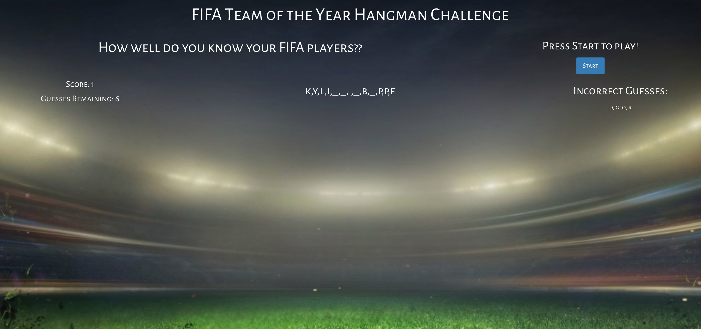

# FIFA TOTY Challenge - A Word-Gess Game by Liam Condon

### Live Link

https://ltcondon.github.io/FIFA-Word-Game/

## Synopsis

The FIFA Team of the Year (TOTY) challenge quizzes a user on their knowledge of FIFA players honored with a TOTY designation by EA Sports in 2019. Upon starting the game a random TOTY player is selected and removed from a list and the user must attempt to guess the player using the keys on their keyboard. If a player is correctly guessed, the user is a lerted they were correct, their score increased, and a new player chosen from the list. If the user guesses incorrectly 10 times, they are alerted they've lost, and the game resets.

## Technologies
The game uses HTML, an external JS file, an external CSS file, Bootstrap, some jQuery and Google fonts (all linked to html file).

## Current State

Currently the game functions correctly, performing all the logic expected of it, however it's display is rather rudimentary, and will be expanded and built out in the future to show dynamic animations and images of players that will also function as hints to the user as their guesses get nearer and nearer to zero.
